# ErgodixDocs System Flow

This diagram maps the current end-to-end functional architecture and major decision gates from install to ingest/render.

```mermaid
flowchart TD
  %% =========================
  %% User Entry + Core Runtime
  %% =========================
  U[User / Contributor] --> CLI[CLI Dispatcher\nergodix entrypoint]

  subgraph S1[Bootstrap and Configuration]
    CLI --> CANT[Cantilever Orchestrator\nInspect -> Plan/Consent -> Configure -> Apply -> Verify]
    CLI --> FLOAT[Floater Registry\nrole + behavior composition]
    CANT --> CONF[Settings Cascade\ndefaults -> bootstrap -> floater]
    CANT --> PREREQ[Prereq Modules\nA/B/C/D/E/F operations]
    CANT --> D_CONSENT{Single consent gate\nfor mutative operations}
    D_CONSENT -->|approve| APPLY[Apply mutative ops]
    D_CONSENT -->|decline| ABORT[Abort safely]
  end

  subgraph S2[Auth and Secrets]
    AUTH[Credential and OAuth Layer\nenv -> keyring -> file fallback]
    TOK[OAuth Token Store\n.ergodix_tokens.json]
    AUTH <--> TOK
  end

  subgraph S3[Import and Index]
    MIG[Migrate Orchestrator\nwalk -> import -> transform -> archive -> manifest]
    IMP[Importer Registry\ngdocs/docx/txt plugins]
    MAN[Run Manifest\n_archive/_runs/*.toml]
    ARCH[_archive originals\nsource preservation]
    IDX[Index Command\n_AI/ergodix.map]

    CLI --> MIG
    MIG --> IMP
    MIG --> AUTH
    MIG --> MAN
    MIG --> ARCH
    CLI --> IDX
  end

  subgraph S4[Authoring Output]
    REND[Render Pipeline\nmarkdown -> pandoc/xelatex -> PDF/DOCX]
    PRE[LaTeX Preamble Cascade\n_folder _preamble.tex walk-up]
    CLI --> REND
    REND --> PRE
  end

  subgraph S5[Collaboration and Sync]
    SO[Sync-Out\neditor save -> commit -> push]
    SI[Sync-In\npoller fetch/check updates]
    POLL[Poller Job\nLaunchAgent/system scheduler]
    PUB[Publish\nmaster -> editor slice]
    ING[Ingest\neditor slice -> review branch]
    SLICE[Slice Registry\nassigned files + baseline SHA]

    CLI --> SO
    CLI --> SI
    CLI --> PUB
    CLI --> ING
    POLL --> SI

    PUB --> SLICE
    ING --> SLICE
    SO --> AUTH
    SI --> AUTH
    PUB --> AUTH
    ING --> AUTH
  end

  %% =========================
  %% Cross-cutting decision boundaries
  %% =========================
  D_AI{AI Action Boundary\nclosed permitted action list}
  D_IDEMP{Idempotency Required\nre-runs safe}
  D_CONN{Connectivity Auto-detect\nonline/offline behavior}
  D_SCOPE{Least-Privilege Scopes\nGoogle readonly only}

  D_AI -. governs .-> MIG
  D_AI -. governs .-> IDX
  D_AI -. governs .-> REND

  D_IDEMP -. governs .-> CANT
  D_IDEMP -. governs .-> MIG
  D_IDEMP -. governs .-> IDX

  D_CONN -. governs .-> CANT
  D_CONN -. governs .-> SI
  D_CONN -. governs .-> POLL

  D_SCOPE -. governs .-> AUTH

  %% Visual classes
  classDef process fill:#e8f4ff,stroke:#1f4b7a,stroke-width:1px,color:#111;
  classDef decision fill:#fff4db,stroke:#8a5a00,stroke-width:1px,color:#111;
  classDef store fill:#eef9e8,stroke:#2f6b2f,stroke-width:1px,color:#111;

  class CLI,CANT,FLOAT,CONF,PREREQ,APPLY,ABORT,AUTH,MIG,IMP,IDX,REND,PRE,SO,SI,POLL,PUB,ING process;
  class D_CONSENT,D_AI,D_IDEMP,D_CONN,D_SCOPE decision;
  class TOK,MAN,ARCH,SLICE store;
```

## Node Reference (Decision and Process Coverage)

| Node | Purpose | ADR references | Story references |
|---|---|---|---|
| `CLI` | Single command dispatcher + subcommand surface | [adrs/0001-click-cli-with-persona-floater-registries.md](../adrs/0001-click-cli-with-persona-floater-registries.md), [adrs/0005-roles-as-floaters-and-opus-naming.md](../adrs/0005-roles-as-floaters-and-opus-naming.md), [adrs/0007-bootstrap-prereqs-cli-entry.md](../adrs/0007-bootstrap-prereqs-cli-entry.md) | [stories/SprintLog.md](../stories/SprintLog.md) |
| `CANT` | Install orchestrator with phased flow | [adrs/0003-cantilever-bootstrap-orchestrator.md](../adrs/0003-cantilever-bootstrap-orchestrator.md), [adrs/0010-installer-preflight-consent-gate.md](../adrs/0010-installer-preflight-consent-gate.md), [adrs/0012-phase-2-patterns-configure-phase-and-five-phase-orchestrator.md](../adrs/0012-phase-2-patterns-configure-phase-and-five-phase-orchestrator.md) | [stories/SprintLog.md](../stories/SprintLog.md) |
| `FLOAT` | Role/behavior extension model for operation selection | [adrs/0001-click-cli-with-persona-floater-registries.md](../adrs/0001-click-cli-with-persona-floater-registries.md), [adrs/0005-roles-as-floaters-and-opus-naming.md](../adrs/0005-roles-as-floaters-and-opus-naming.md) | [stories/SprintLog.md](../stories/SprintLog.md) |
| `CONF` | Settings ownership and cascade resolution | [adrs/0008-cleanup-sync-rename-ownership-autofix-static-analysis.md](../adrs/0008-cleanup-sync-rename-ownership-autofix-static-analysis.md), [adrs/0014-sync-transport-and-settings-cascade.md](../adrs/0014-sync-transport-and-settings-cascade.md), [adrs/0003-cantilever-bootstrap-orchestrator.md](../adrs/0003-cantilever-bootstrap-orchestrator.md) | [stories/SprintLog.md](../stories/SprintLog.md) |
| `PREREQ` | Modular prereq checks/apply operations | [adrs/0007-bootstrap-prereqs-cli-entry.md](../adrs/0007-bootstrap-prereqs-cli-entry.md), [adrs/0010-installer-preflight-consent-gate.md](../adrs/0010-installer-preflight-consent-gate.md), [adrs/0012-phase-2-patterns-configure-phase-and-five-phase-orchestrator.md](../adrs/0012-phase-2-patterns-configure-phase-and-five-phase-orchestrator.md) | [stories/SprintLog.md](../stories/SprintLog.md) |
| `D_CONSENT` | One explicit consent gate before mutative operations | [adrs/0010-installer-preflight-consent-gate.md](../adrs/0010-installer-preflight-consent-gate.md) | [stories/SprintLog.md](../stories/SprintLog.md) |
| `AUTH` | Credential lookup and OAuth lifecycle | [adrs/0015-migrate-from-gdocs.md](../adrs/0015-migrate-from-gdocs.md), [adrs/0001-click-cli-with-persona-floater-registries.md](../adrs/0001-click-cli-with-persona-floater-registries.md), [adrs/0002-repo-topology-and-editor-onboarding.md](../adrs/0002-repo-topology-and-editor-onboarding.md) | [stories/SprintLog.md](../stories/SprintLog.md) |
| `TOK` | Token persistence and refresh continuity | [adrs/0015-migrate-from-gdocs.md](../adrs/0015-migrate-from-gdocs.md) | [stories/SprintLog.md](../stories/SprintLog.md) |
| `MIG` | Import pipeline and archive/manifest idempotency | [adrs/0015-migrate-from-gdocs.md](../adrs/0015-migrate-from-gdocs.md), [adrs/0001-click-cli-with-persona-floater-registries.md](../adrs/0001-click-cli-with-persona-floater-registries.md) | [stories/SprintLog.md](../stories/SprintLog.md) |
| `IMP` | Importer plugin architecture | [adrs/0015-migrate-from-gdocs.md](../adrs/0015-migrate-from-gdocs.md), [adrs/0001-click-cli-with-persona-floater-registries.md](../adrs/0001-click-cli-with-persona-floater-registries.md) | [stories/SprintLog.md](../stories/SprintLog.md) |
| `MAN` | Run records and replay safety | [adrs/0015-migrate-from-gdocs.md](../adrs/0015-migrate-from-gdocs.md) | [stories/SprintLog.md](../stories/SprintLog.md) |
| `ARCH` | Source preservation and rollback traceability | [adrs/0015-migrate-from-gdocs.md](../adrs/0015-migrate-from-gdocs.md) | [stories/SprintLog.md](../stories/SprintLog.md) |
| `IDX` | Corpus hash map for downstream AI tooling | ADR TBD (index decision not yet formalized) | [stories/active/ergodix-index.md](../stories/active/ergodix-index.md) |
| `REND` | Pandoc/XeLaTeX output flow | [adrs/0001-click-cli-with-persona-floater-registries.md](../adrs/0001-click-cli-with-persona-floater-registries.md), [adrs/0003-cantilever-bootstrap-orchestrator.md](../adrs/0003-cantilever-bootstrap-orchestrator.md) | [stories/SprintLog.md](../stories/SprintLog.md) |
| `PRE` | Layered TeX preamble assembly | [adrs/0001-click-cli-with-persona-floater-registries.md](../adrs/0001-click-cli-with-persona-floater-registries.md) | [stories/SprintLog.md](../stories/SprintLog.md) |
| `SO` | Editor outbound sync behavior | [adrs/0004-continuous-repo-polling.md](../adrs/0004-continuous-repo-polling.md), [adrs/0008-cleanup-sync-rename-ownership-autofix-static-analysis.md](../adrs/0008-cleanup-sync-rename-ownership-autofix-static-analysis.md), [adrs/0014-sync-transport-and-settings-cascade.md](../adrs/0014-sync-transport-and-settings-cascade.md) | [stories/SprintLog.md](../stories/SprintLog.md) |
| `SI` | Inbound sync polling behavior | [adrs/0004-continuous-repo-polling.md](../adrs/0004-continuous-repo-polling.md), [adrs/0008-cleanup-sync-rename-ownership-autofix-static-analysis.md](../adrs/0008-cleanup-sync-rename-ownership-autofix-static-analysis.md), [adrs/0014-sync-transport-and-settings-cascade.md](../adrs/0014-sync-transport-and-settings-cascade.md) | [stories/SprintLog.md](../stories/SprintLog.md) |
| `POLL` | Scheduler loop for continuous checks | [adrs/0004-continuous-repo-polling.md](../adrs/0004-continuous-repo-polling.md), [adrs/0003-cantilever-bootstrap-orchestrator.md](../adrs/0003-cantilever-bootstrap-orchestrator.md) | [stories/SprintLog.md](../stories/SprintLog.md) |
| `PUB` | Master-to-slice publication flow | [adrs/0006-editor-collaboration-sliced-repos.md](../adrs/0006-editor-collaboration-sliced-repos.md) | [stories/SprintLog.md](../stories/SprintLog.md) |
| `ING` | Slice-to-master ingest flow with verification | [adrs/0006-editor-collaboration-sliced-repos.md](../adrs/0006-editor-collaboration-sliced-repos.md) | [stories/SprintLog.md](../stories/SprintLog.md) |
| `SLICE` | Ownership/baseline registry for editor slices | [adrs/0006-editor-collaboration-sliced-repos.md](../adrs/0006-editor-collaboration-sliced-repos.md) | [stories/SprintLog.md](../stories/SprintLog.md) |
| `D_AI` | Hard gate on allowed AI actions | [adrs/0013-ai-permitted-actions-boundary.md](../adrs/0013-ai-permitted-actions-boundary.md), [spikes/0010-user-writing-preferences-interview.md](../spikes/0010-user-writing-preferences-interview.md) | [stories/SprintLog.md](../stories/SprintLog.md) |
| `D_IDEMP` | Re-run safety and idempotent behavior | [adrs/0003-cantilever-bootstrap-orchestrator.md](../adrs/0003-cantilever-bootstrap-orchestrator.md), [adrs/0010-installer-preflight-consent-gate.md](../adrs/0010-installer-preflight-consent-gate.md), [adrs/0015-migrate-from-gdocs.md](../adrs/0015-migrate-from-gdocs.md) | [stories/SprintLog.md](../stories/SprintLog.md) |
| `D_CONN` | Online/offline branching behavior | [adrs/0003-cantilever-bootstrap-orchestrator.md](../adrs/0003-cantilever-bootstrap-orchestrator.md), [adrs/0004-continuous-repo-polling.md](../adrs/0004-continuous-repo-polling.md), [adrs/0014-sync-transport-and-settings-cascade.md](../adrs/0014-sync-transport-and-settings-cascade.md) | [stories/SprintLog.md](../stories/SprintLog.md) |
| `D_SCOPE` | Least-privilege API permission envelope | [adrs/0015-migrate-from-gdocs.md](../adrs/0015-migrate-from-gdocs.md), [adrs/0012-phase-2-patterns-configure-phase-and-five-phase-orchestrator.md](../adrs/0012-phase-2-patterns-configure-phase-and-five-phase-orchestrator.md) | [stories/SprintLog.md](../stories/SprintLog.md) |

## Coverage notes

- This map includes implemented and architecturally committed flows so you can visualize current behavior plus locked direction.
- If you want, I can also generate focused diagrams next:
  1. Cantilever phases and operation graph (A1-F2 detail)
  2. Migrate internals (walker/importer/archive/manifest) with failure paths
  3. Collaboration topology (master + slice repos + publish/ingest branches)
